# Long read Assembly process and notes for the hourglass dolphin Harua-tai-nui

- [Long read Assembly process and notes for the hourglass dolphin Harua-tai-nui](#long-read-assembly-process-and-notes-for-the-hourglass-dolphin-harua-tai-nui)
  - [File Conversion and Basecalling](#file-conversion-and-basecalling)
  - [Filtering](#filtering)
    - [Contaminants](#contaminants)
    - [Length and Quality](#length-and-quality)
  - [Assemblies](#assemblies)
  - [Purge Diploid regions and polish](#purge-diploid-regions-and-polish)
    - [Diploid regions](#diploid-regions)
    - [Medaka polish](#medaka-polish)
    - [Busco re-comparison](#busco-re-comparison)
  - [Variant calls](#variant-calls)
    - [Clair3](#clair3)
    - [DeepVariant](#deepvariant)
    - [Variant call visualisations](#variant-call-visualisations)
    - [Phasing](#phasing)
  - [Annotation](#annotation)
    - [Repeat Masking](#repeat-masking)
    - [Braker Annotation](#braker-annotation)
  - [Figure plotting](#figure-plotting)


## File Conversion and Basecalling

`fast5` to `pod5`

```bash
# example
pod5 convert fast5 ./fast5/*fast5  --output pod5s/ --one-to-one ./fast5/
```

```bash
# example
# DORADO 4.1.0
dorado basecaller dna_r10.4.1_e8.2_400bps_sup@v4.1.0 pod5s/ > dolphin-dorado-sup-4-1-0.bam
```

Conversion  
Transform `.bam` output from `dorado` to `fastq`

```bash
samtools fastq dolphin-dorado-sup-4-1-0.bam > dolphin-dorado-sup-4-1-0.fastq
```

## Filtering

### Contaminants

Map out reads against lambdaphage genome, `NC_001416.1` with `minimap2`

```bash
minimap2 -ax map-ont lambda.fasta dolphin-dorado-sup-4-1-0.fastq > dolphin.filt.sam
```

Removed mapped reads from `.sam` file, collected the read names, chopped the header, and selected unmapped reads from the `.fastq`.

```bash
samtools view -f 4 -h dolphin.lambda.sam | cut -f1 > readnames-nolambda.txt
seqkit grep -f readnames-nolambda.txt dolphin.fastq -o dolphin.nolambda.fastq
```

### Length and Quality

Select reads > 2 Kbp length and > q10

```bash
# head and tailcrop at this step
cat dolphin.fastq | chopper -l 2000 -q 10 --threads 40 --headcrop 50 --tailcrop 50 > dolphin.2k.q10.fastq

# for mitochondrial assembly
cat mtdna-mapped.fastq | chopper --minlength 14000 --maxlength 17000 -t 8 > mtdna-filter.fastq
seqkit sample -p 0.05 mtdna-filter.fastq > mtdna-sample.fastq
```

## Assemblies

```bash
raven...

```

`nextDenovo`
Version: `[24589 INFO] 2023-05-15 13:46:21 version:2.5.2`

`goldrush`
Version: `goldrush v1.0.1`

`Raven`
Version: `1.8.1``


## Purge Diploid regions and polish

### Diploid regions

```bash
## estimated commands (not tracked)
purge_haplotigs hist -b raven-dorado-no-second-sorted.bam -G ../raven-dorado-q10.fasta -t 40
purge_haplotigs cov -i raven-dorado-no-second-sorted.bam.gencov -l 9  -m 31  -h 95
purge_haplotigs purge -g ../raven-dorado-q10.fasta -c coverage_stats.csv
```

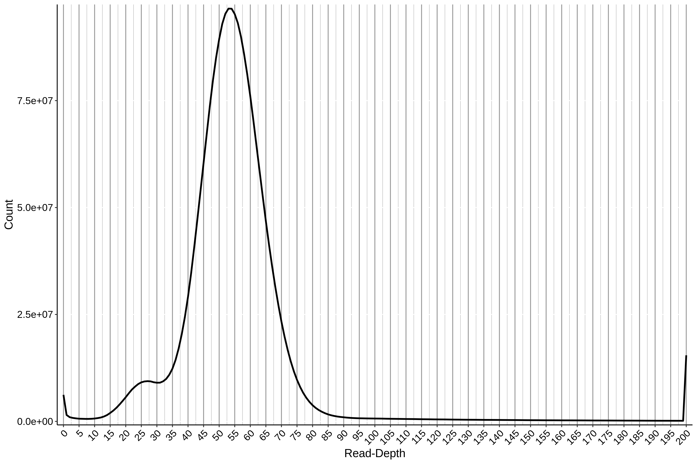  

### Medaka polish

`medaka` version is 1.8:

```bash
# have to run with decreased batch size using -b
medaka_consensus -i dolphin-dorado-q10-2k.fastq -d ../haplotigs/raven-dorado-curated.fasta -o medaka-polished -t 40 -m r1041_e82_400bps_sup_v4.1.a -b 40

## Final purged polished

contigs:895
length:2,383,719,527
min:1,396
mean:2,663,373.8
longest:39,026,300.

Via blast, the outstanding smallest contig (1,396 bp) is a contaminant from Bos taurus, removed. The smallest contig is now 24Kbp, total contigs 894.

To get mean and median depths, subsample the file so that the smallest contig (24kbp) should be sampled 100 times (10,000,000 lines sampled). 

```bash
shuf -n 10000000 raven-purged-polished-clean-depth.txt > raven-purged-polished-clean-depth-sample.txt
```

Use `jellyfish` to characterise kmer counts across contigs.

```bash
# example
for K in 13 17 25 29; do jellyfish count -m $K -s 100M -t 20 raven-bad-contigs.fasta -o raven-bad.${K}.jf; don

# histogram
for K in 13 17 25 29; do jellyfish histo raven-bad.${K}.jf > raven-bad.${K}.histo.txt; done

```

To get all counts per contig, split contigs using `seqkit` and then count for each contig, outputting a `.jf` for each. This is (currently) in the `raven-purged-polished-clean.fasta.split` dir.

### Busco re-comparison

```bash
compleasm.py run -a ../raven-purged-polished-sorted.fasta -o euk -t 20 -l eukaryota
compleasm.py run -a ../raven-purged-polished-sorted.fasta -o euk -t 20 -l mammalia
compleasm.py run -a ../raven-purged-polished-sorted.fasta -o euk -t 20 -l eutheria
compleasm.py run -a ../raven-purged-polished-sorted.fasta -o euk -t 20 -l cetartiodactyla
```

## Variant calls

Used the purged, medaka-polished dorado assembly, sorted, and indexed for use in `Clair3`.

```bash
minimap2 -ax map-ont raven-purged-polished.fasta ../dolphin-dorado-q10-2k.fastq | samtools sort -o raven-purged-polished.bam
```

### Clair3

```bash
run_clair3.sh --bam_fn=raven-purged-polished.bam \
--ref_fn=raven-purged-polished.fasta --threads=40 \
--platform="ont" \
--model_path=rerio/clair3_models/r1041_e82_400bps_sup_v410 \
--output=clair3-calls --include_all_ctgs

## Clair3 final output file: ${OUTPUT_DIR}/merge_output.vcf.gz
```

There is a clear trough of genotype quality scores at 14. We implement a cutoff there:

```bash
rtg vcffilter -Z -q 14 -i merge_output.vcf.gz -o filtered-q14.vcf.gz
```

### DeepVariant

Have to install `docker` for this
```bash
# docker commit: c2de0811708b6d9015ed1a2c80f02c9b70c8ce7b
curl -fsSL https://get.docker.com/ | sh

## docker install
BIN_VERSION="1.5.0"
sudo docker pull google/deepvariant:"${BIN_VERSION}"

## needs the full paths
INPUT_DIR="/scratch/hourglass/variants/deepvariant-calls/input"

OUTPUT_DIR="/scratch/hourglass/variants/deepvariant-calls/output"

sudo docker run -v "${INPUT_DIR}":"/input" -v "${OUTPUT_DIR}":"/output" google/deepvariant:"${BIN_VERSION}" /opt/deepvariant/bin/run_deepvariant --model_type=ONT_R104 --ref=/input/raven-purged-polished.fasta --reads=/input/raven-purged-polished.bam --output_vcf=/output/output.vcf.gz --output_gvcf=/output/output.g.vcf.gz --intermediate_results_dir /output/intermediate_results_dir --num_shards=40

```

### Variant call visualisations

Plots of the results (Clair3 on top, DeepVariant on bottom)
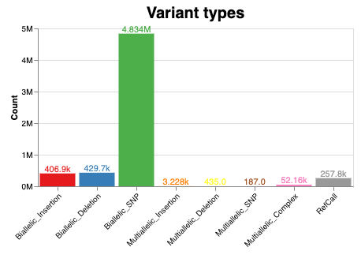<br>
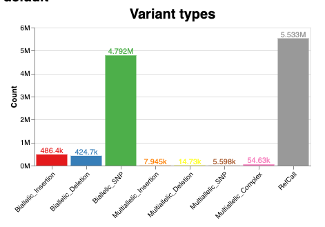<br>

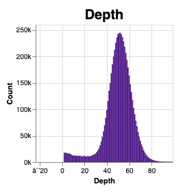 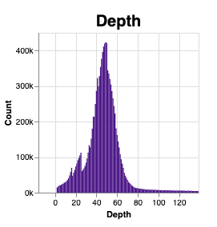<br>

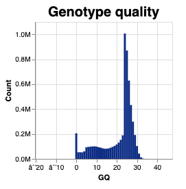 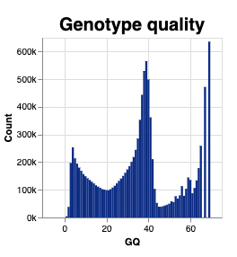<br>

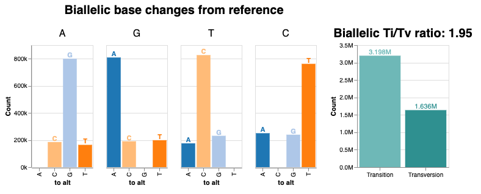<br>
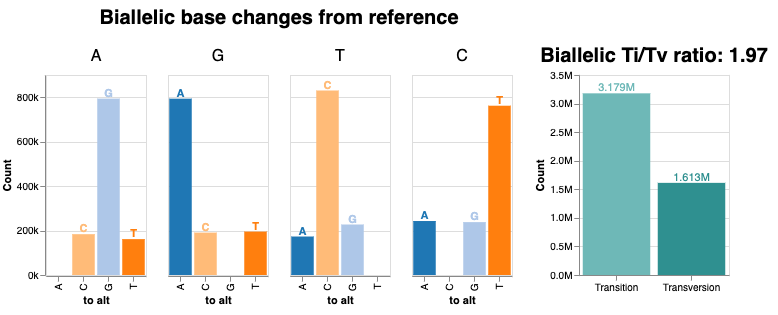<br>

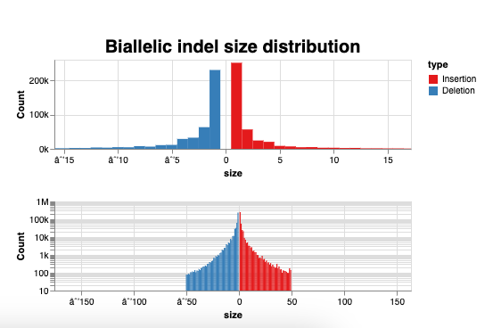<br>
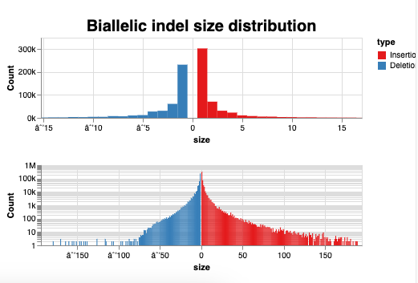<br>

For `DeepVariant` there is a clear trough of genotype quality scores at 20. We implement a cutoff there:

```bash
rtg vcffilter -Z -q 20 -i output.vcf.gz -o dv-filtered-q20.vcf.gz
```

Intersect the `Clair3` and `deepvariant` calls to get a higher confidence set of heterozygous calls.

Use `bcftools norm` and `bcftools isec`:

```bash
bcftools norm -D dv-filtered-q20.vcf.gz > dv-filtered-q20-norm.vcf.gz
bcftools norm -D cl3.filtered-q14.vcf.gz > cl3.filtered-q14-norm.vcf.gz
bcftools isec cl3.filtered-q14-norm.vcf.gz dv-filtered-q20-norm.vcf.gz
```


### Phasing

```bash
whatshap --version 2.0

# standard output

whatshap phase -o phased.vcf --ignore-read-groups --reference=deepvariant-calls/input/raven-purged-polished.fasta cl3-dv-merged.vcf.g
z deepvariant-calls/input/raven-purged-polished.bam                                                                                                                                                                                                                                                                                                                                  
```

Output summary is at least partly in `variants/phased-stats.tsv`.

Phasing for visualisation.

```bash
bgzip phased.vcf
tabix -p vcf phased.vcf.gz

whatshap haplotag --ignore-read-groups --output-threads=40 -o haplotagged.bam --reference deepvariant-calls/input/raven-purged-polished.fasta phased.vcf.gz deepvariant-calls/input/raven-purged-polished.bam

```

## Annotation

### Repeat Masking

```bash

RepeatMasker -pa 10 -species mammalia -html -default_search_engine nhmmer raven-purged-polished.fasta
Search Engine: HMMER [ 3.3.2 (Nov 2020) ]
Using Master RepeatMasker Database: /home/olin/software/RepeatMasker/Libraries/RepeatMaskerLib.h5

Title    : Dfam
Version  : 3.7
Date     : 2023-01-11
Families : 19,768

Species/Taxa Search:
Mammalia [NCBI Taxonomy ID: 40674]

Lineage: root;cellular organisms;Eukaryota;Opisthokonta;Metazoa;Eumetazoa;Bilateria;Deuterostomia;Chordata;Craniata <chordates>;Vertebrata <vertebrates>;Gnathostomata <vertebrates>;Teleostomi;Euteleostomi

214 families in ancestor taxa; 10524 lineage-specific families

analyzing file raven-purged-polished.fasta
```

Make `.bed` file from repeat annotations for intersection with variant calls. RM2bed from [here](https://github.com/rmhubley/RepeatMasker/blob/master/util/RM2Bed.py).

```bash
python RM2Bed.py raven-purged-polished.fasta.out
```

### Braker Annotation

Get the vertebrate OrthoDb from [here](https://bioinf.uni-greifswald.de/bioinf/partitioned_odb11/)

`braker.pl version 3.0.3`


`singularity` notes are [here](https://hub.docker.com/r/teambraker/braker3)

```bash
## the general format to find variant calls within intron (or exons)
bedtools intersect -a cl3-dv-merged.vcf.gz -b braker.introns1.bed -header > cl3-dv-merged.introns.vcf
```

## Figure plotting

The data necessary for figure plotting and the plotting code itse;f are available. It should be possible to download the R code and the `./data` folder and run the R code. Some library installs may be necessary. In addition, the proper working directory `setwd()` will need to be set.